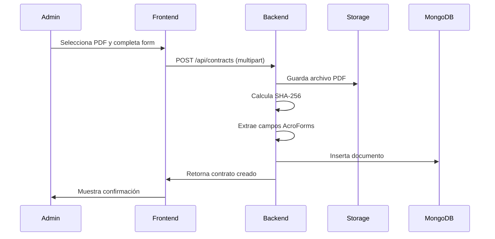
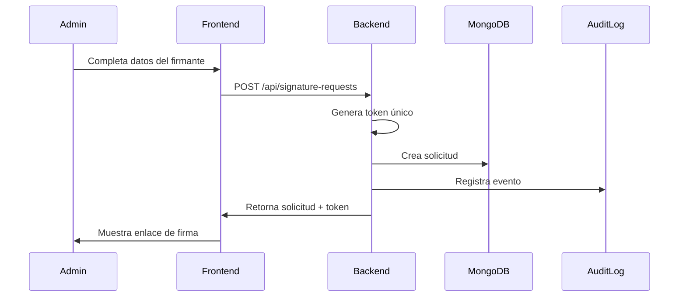
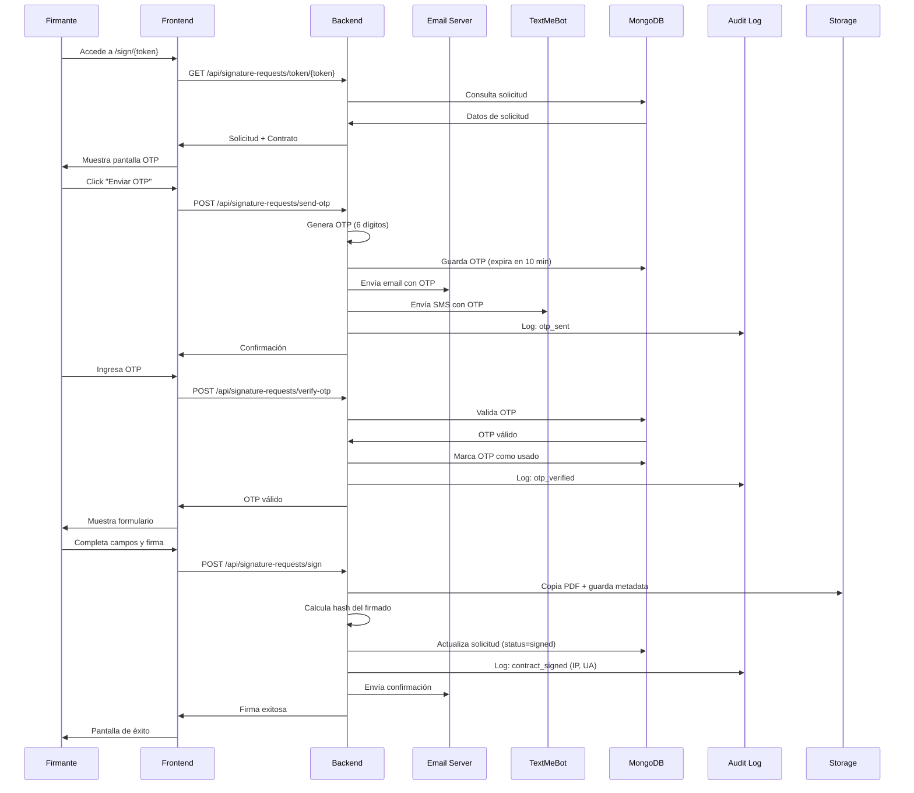
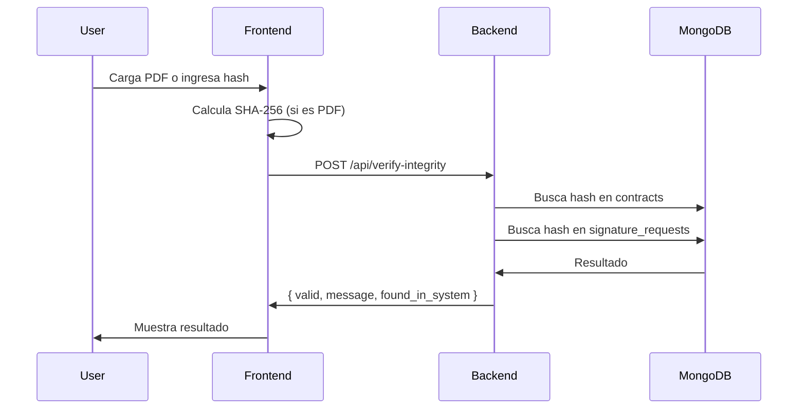

# Arquitectura del Sistema
## Sistema de Firma Electrónica - Academia Jotuns

---

## Índice

1. [Visión General](#visión-general)
2. [Arquitectura de Alto Nivel](#arquitectura-de-alto-nivel)
3. [Componentes del Sistema](#componentes-del-sistema)
4. [Modelo de Datos](#modelo-de-datos)
5. [Flujos de Proceso](#flujos-de-proceso)
6. [Seguridad](#seguridad)
7. [Cumplimiento Normativo](#cumplimiento-normativo)
8. [Escalabilidad](#escalabilidad)

---

## Visión General

### Propósito del Sistema

El Sistema de Firma Electrónica permite la gestión, firma y validación de contratos digitales con plena validez legal en Colombia, cumpliendo con:
- **Ley 527 de 1999**: Comercio Electrónico
- **Decreto 2364 de 2012**: Firma Electrónica

### Tecnologías Utilizadas

| Componente | Tecnología | Versión |
|------------|-----------|---------|
| Backend Framework | FastAPI | 0.110+ |
| Frontend Framework | React | 19.0+ |
| Base de Datos | MongoDB | 4.5+ |
| Lenguaje Backend | Python | 3.11+ |
| Lenguaje Frontend | JavaScript (ES6+) | - |
| UI Library | Shadcn/UI + Tailwind CSS | 3.4+ |
| Email Service | SMTP (aiosmtplib) | 5.0+ |
| SMS Service | TextMeBot API | - |
| PDF Processing | PyPDF2 | 3.0+ |
| Hashing | SHA-256 (hashlib) | Built-in |

---

## Arquitectura de Alto Nivel

```
┌─────────────────────────────────────────────────────────────────┐
│                         CLIENTE (Navegador)                      │
│                   - Administradores                              │
│                   - Firmantes                                    │
└────────────────────┬────────────────────────────────────────────┘
                     │ HTTPS
                     ▼
┌─────────────────────────────────────────────────────────────────┐
│                    NGINX / PROXY REVERSO                         │
│                   - Terminación SSL/TLS                          │
│                   - Enrutamiento                                 │
└────────────────────┬────────────────────────────────────────────┘
                     │
        ┌────────────┴────────────┐
        │                         │
        ▼                         ▼
┌──────────────┐          ┌──────────────┐
│   FRONTEND   │          │   BACKEND    │
│  React App   │◄────────►│  FastAPI     │
│  (Port 3000) │          │  (Port 8001) │
└──────────────┘          └──────┬───────┘
                                 │
                    ┌────────────┼────────────┐
                    │            │            │
                    ▼            ▼            ▼
            ┌──────────┐  ┌──────────┐  ┌──────────┐
            │ MongoDB  │  │   SMTP   │  │TextMeBot │
            │   DB     │  │  Server  │  │   API    │
            └──────────┘  └──────────┘  └──────────┘
```

### Capas de la Arquitectura

1. **Capa de Presentación**: React SPA (Single Page Application)
2. **Capa de API**: FastAPI REST API
3. **Capa de Lógica de Negocio**: Servicios Python
4. **Capa de Persistencia**: MongoDB
5. **Capa de Integraciones Externas**: SMTP y TextMeBot

---

## Componentes del Sistema

### 3.1. Frontend (React)

#### Estructura de Directorios

```
/app/frontend/
├── public/
│   └── assets/
│       └── logo.png
├── src/
│   ├── components/
│   │   ├── ui/              # Componentes Shadcn
│   │   └── AdminLayout.jsx  # Layout administrativo
│   ├── pages/
│   │   ├── AdminLogin.jsx
│   │   ├── AdminDashboard.jsx
│   │   ├── Contracts.jsx
│   │   ├── SignatureRequests.jsx
│   │   ├── AuditLogs.jsx
│   │   ├── VerifyIntegrity.jsx
│   │   └── SignContract.jsx
│   ├── App.js
│   ├── App.css
│   ├── index.js
│   └── index.css
├── package.json
└── tailwind.config.js
```

#### Características Principales

- **SPA con React Router**: Navegación sin recargas
- **State Management**: React Hooks (useState, useEffect)
- **UI Components**: Shadcn/UI + Tailwind CSS
- **Notificaciones**: Sonner (toast notifications)
- **HTTP Client**: Axios

#### Rutas de la Aplicación

| Ruta | Acceso | Descripción |
|------|--------|-------------|
| `/admin/login` | Público | Login administrativo |
| `/admin/dashboard` | Autenticado | Dashboard principal |
| `/admin/contracts` | Autenticado | Gestión de contratos |
| `/admin/signature-requests` | Autenticado | Solicitudes de firma |
| `/admin/audit-logs` | Autenticado | Logs de auditoría |
| `/admin/verify` | Autenticado | Verificación de integridad |
| `/sign/:token` | Público | Portal de firma |

### 3.2. Backend (FastAPI)

#### Estructura de Directorios

```
/app/backend/
├── server.py              # Aplicación principal
├── .env                   # Variables de entorno
├── requirements.txt       # Dependencias Python
└── storage/
    ├── contracts/         # PDFs originales
    └── signed/            # PDFs firmados + metadata
```

#### Endpoints de la API

##### Autenticación

```
POST /api/auth/admin/login
  Body: { username, password }
  Response: { success, token, message }
```

##### Contratos

```
GET    /api/contracts
POST   /api/contracts (multipart/form-data)
GET    /api/contracts/{id}
GET    /api/contracts/{id}/download
```

##### Solicitudes de Firma

```
GET    /api/signature-requests
POST   /api/signature-requests
GET    /api/signature-requests/{id}
GET    /api/signature-requests/token/{token}
POST   /api/signature-requests/send-otp
POST   /api/signature-requests/verify-otp
POST   /api/signature-requests/sign
```

##### Auditoría

```
GET    /api/audit-logs
GET    /api/audit-logs?request_id={id}
```

##### Verificación

```
POST   /api/verify-integrity
  Body: { file_hash }
  Response: { valid, message, found_in_system }
```

##### Dashboard

```
GET    /api/dashboard/stats
  Response: { 
    total_contracts,
    total_requests, 
    pending_requests,
    signed_requests 
  }
```

#### Servicios del Backend

1. **Email Service** (`send_email`):
   - Envío de OTP
   - Confirmación de firma
   - Notificaciones generales

2. **SMS Service** (`send_sms`):
   - Envío de OTP vía TextMeBot API

3. **PDF Service**:
   - Extracción de campos AcroForms
   - Copia y almacenamiento de PDFs firmados

4. **Hash Service** (`calculate_file_hash`):
   - Cálculo de SHA-256
   - Verificación de integridad

5. **OTP Service**:
   - Generación de códigos aleatorios
   - Validación y expiración (10 minutos)

6. **Audit Service** (`log_audit`):
   - Registro inmutable de eventos
   - Captura de IP y User-Agent

### 3.3. Base de Datos (MongoDB)

#### Colecciones

**1. `contracts`**
```javascript
{
  id: String (UUID),
  name: String,
  description: String,
  file_path: String,
  file_hash: String (SHA-256),
  fields: Array<{name, type}>,
  created_at: ISODateTime
}
```

**2. `signature_requests`**
```javascript
{
  id: String (UUID),
  contract_id: String,
  signer_name: String,
  signer_email: String,
  signer_phone: String,
  status: String (pending|otp_sent|signed|rejected),
  token: String (unique),
  created_at: ISODateTime,
  signed_at: ISODateTime,
  signed_file_path: String,
  signed_file_hash: String
}
```

**3. `otps`**
```javascript
{
  id: String (UUID),
  request_id: String,
  otp: String (6 digits),
  expiry: ISODateTime,
  used: Boolean
}
```

**4. `audit_logs`**
```javascript
{
  id: String (UUID),
  request_id: String,
  action: String,
  details: Object,
  timestamp: ISODateTime,
  ip_address: String,
  user_agent: String
}
```

#### Índices Recomendados

```javascript
// contracts
db.contracts.createIndex({ "id": 1 }, { unique: true });
db.contracts.createIndex({ "file_hash": 1 });

// signature_requests
db.signature_requests.createIndex({ "id": 1 }, { unique: true });
db.signature_requests.createIndex({ "token": 1 }, { unique: true });
db.signature_requests.createIndex({ "status": 1 });

// otps
db.otps.createIndex({ "request_id": 1 });
db.otps.createIndex({ "expiry": 1 }, { expireAfterSeconds: 0 });

// audit_logs
db.audit_logs.createIndex({ "request_id": 1 });
db.audit_logs.createIndex({ "timestamp": -1 });
```

---

## Flujos de Proceso

### 4.1. Flujo de Carga de Contrato



### 4.2. Flujo de Creación de Solicitud



### 4.3. Flujo Completo de Firma Electrónica



### 4.4. Flujo de Verificación de Integridad



---

## Seguridad

### 5.1. Autenticación y Autorización

#### Administradores
- **Método**: Credenciales de usuario/contraseña
- **Almacenamiento**: Variables de entorno
- **Token**: Generado con `secrets.token_urlsafe(32)`
- **Almacenamiento del token**: LocalStorage (frontend)

#### Firmantes
- **Método**: OTP (One-Time Password)
- **Autenticación de dos factores**:
  1. Token único en URL
  2. OTP enviado por email/SMS
- **Sin necesidad de registro**

### 5.2. Cifrado y Hash

#### Comunicaciones
- **TLS/SSL**: Todas las comunicaciones HTTPS
- **Email**: TLS en SMTP (puerto 465)

#### Integridad de Documentos
- **Algoritmo**: SHA-256
- **Longitud**: 64 caracteres hexadecimales
- **Cálculo**: Al cargar contrato y al firmar
- **Uso**: Verificación de no modificación

### 5.3. Almacenamiento Seguro

#### Archivos PDF
- **Ubicación**: `/app/backend/storage/`
- **Permisos**: Solo accesible por el servidor
- **Backup**: Recomendado diario

#### Base de Datos
- **MongoDB**: Autenticación habilitada
- **Cifrado en reposo**: Configuración del servidor
- **Backup**: Recomendado diario con `mongodump`

### 5.4. Protección contra Amenazas

| Amenaza | Mitigación |
|---------|-----------|
| SQL Injection | N/A (MongoDB no SQL) |
| NoSQL Injection | Validación con Pydantic |
| XSS | React escapa por defecto |
| CSRF | SameSite cookies, tokens |
| Brute Force OTP | Expiración 10 min, uso único |
| Man-in-the-Middle | HTTPS/TLS obligatorio |

### 5.5. Trazabilidad de Seguridad

Cada acción de firma registra:
- **IP Address**: Dirección IP del firmante
- **User Agent**: Navegador y sistema operativo
- **Timestamp**: Fecha y hora exacta (UTC)
- **Request ID**: Identificador único
- **Action**: Acción realizada

---

## Cumplimiento Normativo

### 6.1. Ley 527 de 1999

#### Artículo 7 - Requisitos de la Firma Digital

| Requisito | Implementación |
|-----------|----------------|
| **Identificación del firmante** | - Email corporativo<br>- OTP enviado al email<br>- Registro en audit log |
| **Manifestación de voluntad** | - Checkbox de aceptación explícita<br>- Completado de formulario<br>- Confirmación activa |
| **Asociación con el mensaje** | - Hash SHA-256 del documento<br>- Metadata de firma vinculada<br>- Timestamp preciso |
| **Método confiable** | - Autenticación de dos factores<br>- OTP de uso único<br>- Trazabilidad completa |

### 6.2. Decreto 2364 de 2012

#### Artículo 4 - Confiabilidad del Método

| Requisito | Implementación |
|-----------|----------------|
| **Datos exclusivos del firmante** | - OTP único por solicitud<br>- Email personal del firmante<br>- No reutilizable |
| **Control sobre los datos** | - OTP solo conocido por firmante<br>- Expiración de 10 minutos<br>- Una sola verificación |
| **Detección de alteraciones** | - Hash SHA-256<br>- Verificación de integridad<br>- Inmutabilidad de logs |

#### Artículo 6 - Obligaciones del Firmante

| Obligación | Implementación |
|------------|----------------|
| **Custodia del OTP** | - Advertencia en email<br>- Instrucciones claras<br>- No compartir código |
| **Notificación de compromiso** | - Contacto de soporte<br>- Proceso de invalidación |

### 6.3. Evidencia Probatoria

Para efectos judiciales, el sistema proporciona:

1. **Logs de Auditoría**:
   - Registro inmutable de eventos
   - Timestamp con precisión de milisegundos
   - IP y User-Agent del firmante

2. **Hash SHA-256**:
   - Prueba de integridad
   - Estándar NIST FIPS 180-4
   - Inviolable

3. **Metadata de Firma**:
   - Datos del firmante
   - Fecha y hora exacta
   - Método de autenticación
   - Datos del formulario completado

4. **Correos Electrónicos**:
   - Envío de OTP
   - Confirmación de firma
   - Registro en servidor SMTP

---

## Escalabilidad

### 7.1. Escalabilidad Horizontal

#### Backend
```
┌────────────┐
│ Load       │
│ Balancer   │
└─────┬──────┘
      │
┌─────┴─────┬─────────┬─────────┐
│           │         │         │
▼           ▼         ▼         ▼
Backend1  Backend2  Backend3  BackendN
```

- FastAPI soporta múltiples instancias
- Sin estado (stateless)
- MongoDB como store centralizado

#### Frontend
- React SPA se puede servir desde CDN
- Static hosting (Netlify, Vercel, S3+CloudFront)

### 7.2. Optimización de Base de Datos

#### Sharding
```javascript
// Por contract_id
sh.shardCollection("jotuns_contracts.signature_requests", 
  { "contract_id": 1 }
)

// Por fecha
sh.shardCollection("jotuns_contracts.audit_logs", 
  { "timestamp": 1 }
)
```

#### Replica Set
```
Primary ──┬── Secondary1
          └── Secondary2
```

### 7.3. Caching

#### Opciones de Cache
- **Redis**: Cache de contratos frecuentes
- **CDN**: Assets estáticos del frontend
- **Browser Cache**: Headers de cache apropiados

### 7.4. Límites Actuales

| Recurso | Límite Actual | Escalable a |
|---------|---------------|-------------|
| Contratos simultáneos | ~1000 | Ilimitado |
| Solicitudes/día | ~10,000 | 1M+ |
| Almacenamiento | Depende del VPS | Cloud S3 |
| Usuarios concurrentes | ~500 | 10,000+ |

### 7.5. Monitoreo

Métricas recomendadas:
- **API Response Time**: < 200ms p95
- **Database Query Time**: < 50ms p95
- **OTP Delivery Time**: < 30s
- **Error Rate**: < 0.1%
- **Uptime**: > 99.9%

Herramientas sugeridas:
- Prometheus + Grafana
- ELK Stack (logs)
- New Relic / DataDog (APM)

---

## Diagramas Adicionales

### 8.1. Diagrama de Componentes

```
┌─────────────────────────────────────────────────────┐
│                    FRONTEND (React)                  │
├─────────────────────────────────────────────────────┤
│  Pages         Components      Services             │
│  ├─ AdminLogin  ├─ AdminLayout  ├─ axios            │
│  ├─ Dashboard   ├─ UI (Shadcn)  └─ utils            │
│  ├─ Contracts   └─ ...                              │
│  ├─ Requests                                        │
│  ├─ AuditLogs                                       │
│  ├─ Verify                                          │
│  └─ SignContract                                    │
└─────────────────────────────────────────────────────┘
                        │ REST API
                        ▼
┌─────────────────────────────────────────────────────┐
│                   BACKEND (FastAPI)                  │
├─────────────────────────────────────────────────────┤
│  Routes          Services       Utilities           │
│  ├─ /auth        ├─ email       ├─ hash            │
│  ├─ /contracts   ├─ sms         ├─ otp_gen        │
│  ├─ /requests    ├─ pdf         └─ audit           │
│  ├─ /audit-logs  └─ hash                           │
│  └─ /verify                                         │
└─────────────────────────────────────────────────────┘
         │                │                │
         ▼                ▼                ▼
    ┌────────┐      ┌────────┐      ┌────────┐
    │MongoDB │      │  SMTP  │      │TextMe  │
    │   DB   │      │ Server │      │  Bot   │
    └────────┘      └────────┘      └────────┘
```

### 8.2. Diagrama de Estados - Solicitud de Firma

```
┌─────────┐
│ PENDING │ Creada
└────┬────┘
     │ send_otp()
     ▼
┌──────────┐
│ OTP_SENT │ Código enviado
└────┬─────┘
     │ verify_otp() + sign()
     ▼
┌────────┐
│ SIGNED │ Firmado
└────────┘

     │ reject()
     ▼
┌──────────┐
│ REJECTED │ Rechazado
└──────────┘
```

---

## Glosario Técnico

| Término | Definición |
|---------|-----------|
| **OTP** | One-Time Password - Contraseña de un solo uso |
| **SHA-256** | Secure Hash Algorithm 256-bit - Algoritmo de hash criptográfico |
| **AcroForms** | Formato de formularios interactivos en PDF |
| **JWT** | JSON Web Token - Token de autenticación |
| **SMTP** | Simple Mail Transfer Protocol - Protocolo de envío de emails |
| **API REST** | Representational State Transfer - Arquitectura de API |
| **UUID** | Universally Unique Identifier - Identificador único universal |
| **TLS/SSL** | Transport Layer Security - Cifrado de comunicaciones |
| **CDN** | Content Delivery Network - Red de distribución de contenido |

---

**Versión**: 1.0  
**Fecha**: Diciembre 2025  
**Academia Jotuns Club SAS**
